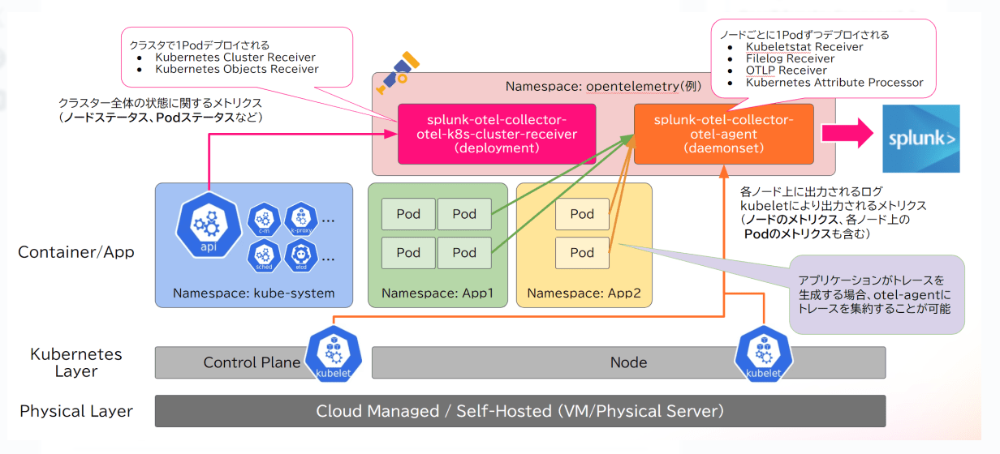

# profiling-Nah-tracing-Nah-Wing-it

```bash
# ref: https://github.com/melanmeg/k8s_1-31_on_nobel
# ./composeは検証用

# ref: https://kubernetes.io/docs/tasks/debug/debug-cluster/resource-metrics-pipeline/
# リソース メトリック パイプライン
```

### タスク
```bash
・istio
```

### マイグレーションコマンド
```bash
kubeadm config migrate --old-config /tmp/init_kubeadm.yaml --new-config new_init_kubeadm.yaml
kubeadm config migrate --old-config /tmp/join_kubeadm_cp.yaml --new-config new_join_kubeadm_cp.yaml
kubeadm config migrate --old-config /tmp/join_kubeadm_wk.yaml --new-config new_join_kubeadm_wk.yaml
```

### 適当Memo
- ref: https://v1-30.docs.kubernetes.io/docs/setup/production-environment/tools/kubeadm/high-availability/#steps-for-the-rest-of-the-control-plane-nodes-1
- ref: https://v1-30.docs.kubernetes.io/docs/setup/production-environment/tools/kubeadm/high-availability/#manual-certs
- ref: https://www.server-world.info/query?os=Ubuntu_24.04&p=kubernetes&f=8
```bash
$ kubeadm init phase upload-certs --upload-certs
1e6ddeb7e0f1899e2272f69c13c8fa4bc3d4c9cd4f8f33837f210ae2ac889587

$ kubeadm token create --print-join-command
kubeadm join 192.168.11.110:6443 --token ey544l.7gvqjml99v08t5k9 --discovery-token-ca-cert-hash sha256:cfd36a88a78d469cf521998a4891a0317a75889f2e73c338ddbcba9dcee47754

kubectl auth can-i list configmaps --as system:kube-scheduler
kubectl auth can-i list nodes --as=kubernetes-admin -A
```


### istio入門メモ
```bash
Available Commands:
  controlz     Open ControlZ web UI
  envoy        Open Envoy admin web UI
  grafana      Open Grafana web UI
  istiod-debug Open Istio debug web UI
  jaeger       Open Jaeger web UI
  kiali        Open Kiali web UI
  prometheus   Open Prometheus web UI
  proxy        Open admin web UI for a proxy
  skywalking   Open SkyWalking UI
  zipkin       Open Zipkin web UI
```

```bash
curl -L https://istio.io/downloadIstio | sh -
cd istio-1.23.1
export PATH=$PWD/bin:$PATH
istioctl install -f samples/bookinfo/demo-profile-no-gateways.yaml -y
kubectl label namespace default istio-injection=enabled
kubectl get crd gateways.gateway.networking.k8s.io &> /dev/null || \
{ kubectl kustomize "github.com/kubernetes-sigs/gateway-api/config/crd?ref=v1.1.0" | kubectl apply -f -; }
kubectl apply -f https://raw.githubusercontent.com/istio/istio/release-1.23/samples/bookinfo/platform/kube/bookinfo.yaml
kubectl exec "$(kubectl get pod -l app=ratings -o jsonpath='{.items[0].metadata.name}')" -c ratings -- curl -sS productpage:9080/productpage | grep -o "<title>.*</title>"
kubectl apply -f samples/bookinfo/gateway-api/bookinfo-gateway.yaml
kubectl annotate gateway bookinfo-gateway networking.istio.io/service-type=ClusterIP --namespace=default

# App
# kubectl port-forward svc/bookinfo-gateway-istio 8080:80
# ssh -N -L 8080:localhost:8080 cp4
# http://localhost:8080/productpage

# send request
# for i in $(seq 1 100); do curl -s -o /dev/null "http://localhost:8080/productpage"; done

kubectl apply -f samples/addons
kubectl rollout status deployment/kiali -n istio-system
# Kiali
# istioctl d kiali
# ssh -N -L 8081:localhost:20001 cp4
# http://localhost:8081/kiali

# Grafana
# istioctl d grafana
# ssh -N -L 8082:localhost:3000 cp4
# http://localhost:8082

# Jaeger
# istioctl d jaeger
# ssh -N -L 8083:localhost:16686 cp4
# http://localhost:8083

# envoy
# istioctl d envoy deployment/productpage-v1
# ssh -N -L 8084:localhost:15000 cp4
# http://localhost:8084
```

- with helm
```bash
### ref: https://istio.io/latest/docs/ambient/install/helm/
helm repo add istio https://istio-release.storage.googleapis.com/charts
helm repo update

helm install istio-base istio/base \
  --version 1.23.1 \
  -n istio-system \
  --create-namespace

kubectl get crd gateways.gateway.networking.k8s.io &> /dev/null || \
  { kubectl apply -f https://github.com/kubernetes-sigs/gateway-api/releases/download/v1.1.0/standard-install.yaml; }

helm install istiod istio/istiod \
  --version 1.23.1 \
  -n istio-system \
  --set profile=ambient

helm install istio-cni istio/cni \
  --version 1.23.1 \
  -n istio-system \
  --set profile=ambient

helm install ztunnel istio/ztunnel \
  --version 1.23.1 \
  -n istio-system

helm install istio-ingress istio/gateway \
  --version 1.23.1 \
  -n istio-ingress \
  --create-namespace

# $ helm ls -n istio-system
# $ helm status istio-base -n istio-system
# $ helm get all istio-base -n istio-system

kubectl apply -f https://raw.githubusercontent.com/istio/istio/release-1.23/samples/bookinfo/platform/kube/bookinfo.yaml
kubectl apply -f https://raw.githubusercontent.com/istio/istio/release-1.23/samples/bookinfo/platform/kube/bookinfo-versions.yaml

kubectl apply -f https://raw.githubusercontent.com/istio/istio/release-1.23/samples/bookinfo/gateway-api/bookinfo-gateway.yaml
kubectl annotate gateway bookinfo-gateway networking.istio.io/service-type=ClusterIP --namespace=default

# kubectl port-forward svc/bookinfo-gateway-istio 8080:80

kubectl label namespace default istio.io/dataplane-mode=ambient

kubectl apply -f https://raw.githubusercontent.com/istio/istio/release-1.23/samples/addons/prometheus.yaml
kubectl apply -f https://raw.githubusercontent.com/istio/istio/release-1.23/samples/addons/kiali.yaml

kubectl label namespace logging istio.io/dataplane-mode=ambient

# Integration with Istio: https://docs.cilium.io/en/latest/network/servicemesh/istio/

# Grafana Beylaの出来るコト出来ないコト: https://zenn.dev/kojake_300/articles/4238a66124d095
```

### otel入門
```bash
helm repo add open-telemetry https://open-telemetry.github.io/opentelemetry-helm-charts
helm install my-otel-demo open-telemetry/opentelemetry-demo
kubectl port-forward svc/my-otel-demo-frontendproxy 8080:8080
ssh -N -L 8080:localhost:8080 cp4
# With the frontendproxy port-forward set up, you can access:
#   Web store: http://localhost:8080/
#   Grafana: http://localhost:8080/grafana/
#   Load Generator UI: http://localhost:8080/loadgen/
#   Jaeger UI: http://localhost:8080/jaeger/ui/

# New OTel tracing features in Envoy and Istio: https://opentelemetry.io/blog/2024/new-otel-features-envoy-istio/

# https://www.logicmonitor.jp/blog/opentelemetry-vs-prometheus
```

### Hubble入門
```bash
https://docs.cilium.io/en/latest/network/servicemesh/gateway-api/gamma/
https://docs.cilium.io/en/stable/observability/grafana/
https://docs.cilium.io/en/stable/observability/metrics/#metrics


# ロードマップ
https://docs.cilium.io/en/stable/community/roadmap/#rm-hubble-observability
```

- ref: https://zenn.dev/kntr_nkgm/articles/fd8306cdcf56b6



- ref:
https://findy-tools.io/articles/nttdata-opentelemetry/18
https://findy-tools.io/articles/opentelemetry/12
https://grafana.com/docs/mimir/latest/configure/configure-otel-collector/
https://github.com/open-telemetry/opentelemetry-collector-contrib/tree/main/exporter/prometheusremotewriteexporter
